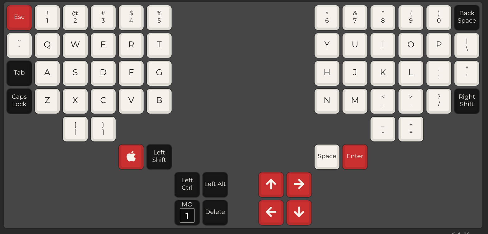
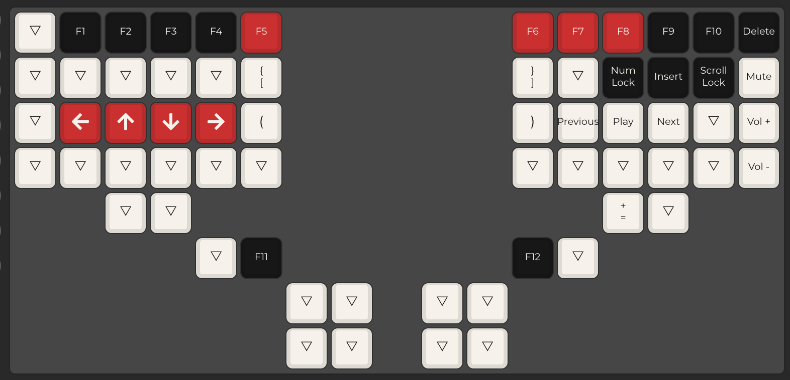

# Enkaboard Configuration Files

My remix of a dactyl manuform with a custom keymap running KMK on the RP2040.

Check [KMK](https://github.com/KMKfw/kmk_firmware/blob/master/docs/en/Getting_Started.md) for and installation guide on how to flash firmware. Custom 3d printed files are also availible in the repo.

BOM is included in repo below to buy all the parts.